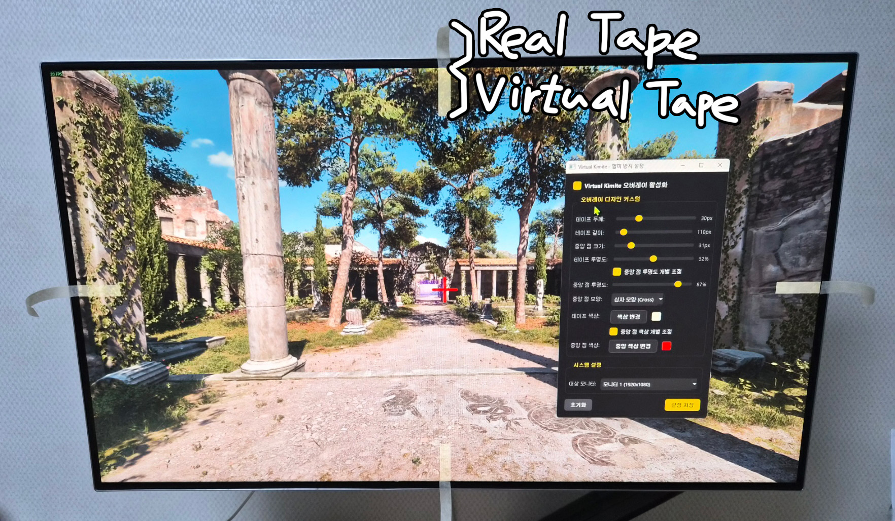

# Virtual Kimite (버추얼 키미테) 🎯



Virtual Kimite는 3D 게임, 영화 감상, 혹은 급격한 화면 전환 시 발생하는 화면 멀미(Motion Sickness)를 효과적으로 방지하기 위해 화면 상에 반투명한 노란색 가이드라인 테이프를 붙여주는 Windows 데스크톱 오버레이 프로그램입니다. 

실제 모니터에 포스트잇이나 테이프를 붙이지 않고도 화면 상/하/좌/우/중앙에 기준점을 세워주어 시각적 안정감을 제공합니다.

---

## ✨ 주요 기능

* 📐 **오버레이 가이드라인**: 모니터 상단, 하단, 좌측, 우측 중앙에 테이프 형태의 반투명 바와 화면 한가운데에 고정 마크를 표시합니다.
* 🖱️ **클릭 관통 (Click-Through)**: 전체 화면 투명 창이 항상 위에 떠있지만, Windows API를 통해 마우스 클릭 및 모든 조작이 오버레이 창을 그대로 관통합니다. 웹 서핑이나 게임 플레이 등 일반 컴퓨터 사용에 전혀 방해가 되지 않습니다.
* ⚙️ **실시간 디자인 커스텀**: 설정 대화창을 통해 테이프의 **두께, 길이, 중앙 마크 크기, 테이프 색상, 전체 투명도**를 실시간 슬라이더로 변경하고 바로 반영할 수 있습니다.
* 🎯 **다양한 중앙 점 모양**: 중앙 고정 마크의 모양을 사용자의 취향이나 화면 가시성에 맞춰 선택할 수 있습니다.
  * **마름모 (Diamond)** / **원형 (Circle)** / **정사각형 (Square)** / **십자 모양 (Cross)**
* 🌓 **중앙 점 투명도 동시/개별 제어**: 
  * 기본 상태에서는 테이프 투명도와 중앙 점 투명도가 동시에 동기화되어 조작됩니다.
  * 개별 조절 옵션을 활성화하면 중앙 고정 점의 투명도만 따로 독립적으로 슬라이더 제어할 수 있습니다. (개별 조절 해제 시에는 관련 슬라이더가 자동으로 숨겨져 UI가 깔끔하게 유지됩니다.)
* 💻 **멀티 모니터 완벽 지원**: 다중 모니터 사용 환경 시 원하는 대상 모니터를 선택하여 오버레이를 해당 화면으로 손쉽게 보낼 수 있습니다.
* 📥 **설정 자동 저장**: 설정 창에서 "설정 저장"을 완료하면 `config.json`에 영구 저장되어 다음에 프로그램을 켤 때도 동일한 세팅으로 시작합니다.
* 🗃️ **시스템 트레이 상주**: 설정 창의 `X` 단추를 누르면 완전히 종료되지 않고 백그라운드 트레이에 최소화되어 작동하며, 언제든지 트레이 아이콘을 더블 클릭해 다시 설정을 띄울 수 있습니다.

---

## 🛠️ 기술 스택

* **Language**: Python 3.11+
* **GUI Framework**: PySide6 (Qt for Python 6.8.1)
* **OS API**: `ctypes`를 활용한 Windows User32 API 연동 (클릭 관통 및 윈도우 스타일 제어)

---

## 🚀 시작하기

### 1. 필수 요구사항
파이썬(Python 3.11 이상)이 Windows 시스템에 설치되어 있어야 합니다.

### 2. 패키지 설치
프로젝트 루트 디렉토리에서 아래 명령어를 실행하여 필요한 GUI 패키지를 설치합니다:
```bash
pip install -r requirements.txt
```

### 3. 프로그램 실행
* **간편 원클릭 실행 (추천)**:
  프로젝트 폴더 내의 `run.bat` 파일을 더블 클릭하여 실행합니다. (검은색 콘솔 창이 뜨지 않아 바탕화면이 깔끔하게 유지됩니다.)
* **터미널 실행**:
  파워쉘 혹은 CMD 터미널에서 아래 스크립트를 기동합니다:
  ```bash
  python main.py
  ```

---

## 📂 파일 구조

```text
KIMITE/
├── .gitignore          # 깃 제외 목록 (로컬 config.json 등 제외)
├── requirements.txt    # 의존성 라이브러리 목록 (PySide6)
├── run.bat             # 검은 콘솔 창 없이 백그라운드로 실행하는 배치 파일
├── config.py           # 오버레이 설정 데이터 관리 및 JSON 입출력
├── overlay.py          # 마우스 관통 투명 오버레이 렌더링 화면
├── settings_window.py  # 세련된 다크 테마 QSS 스타일 제어 창
└── main.py             # 시스템 트레이 상주 및 앱 실행 생명주기 제어
```
